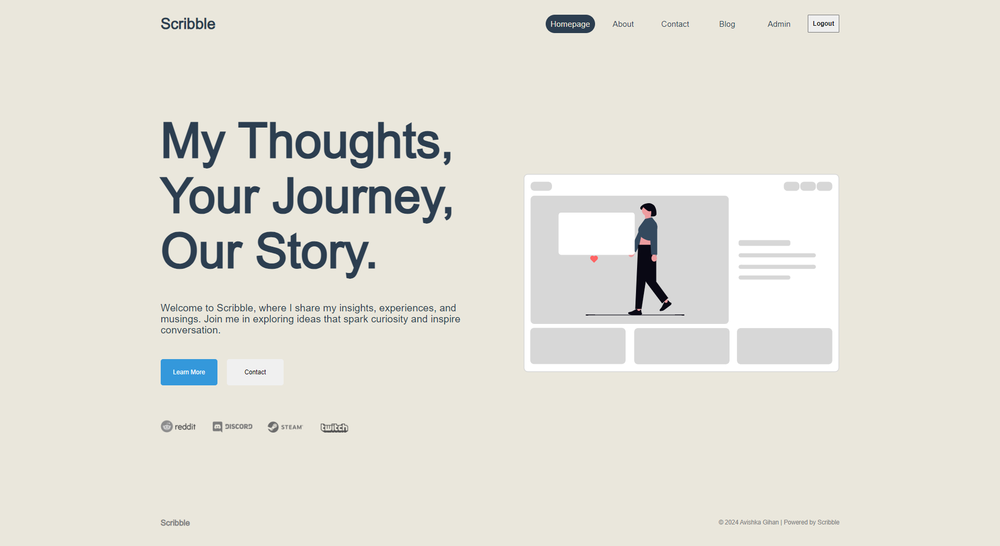
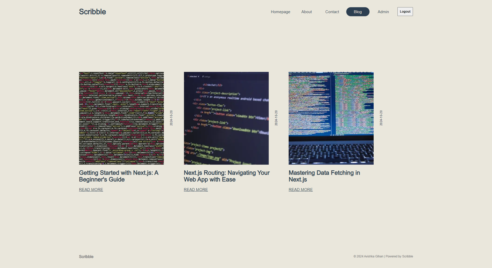
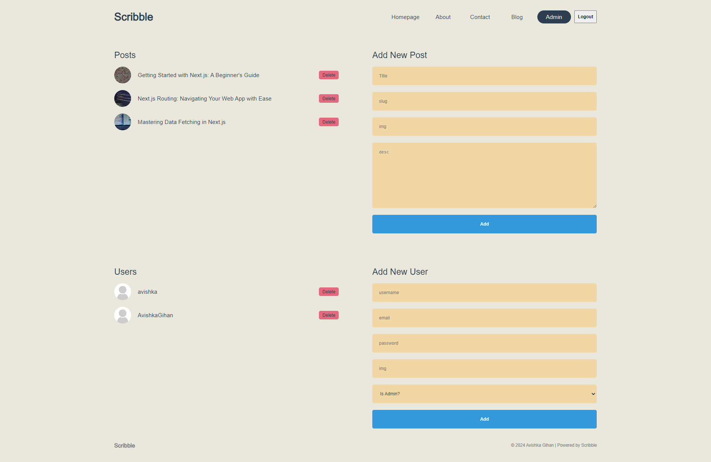

# Scribble Blog App

Scribble is a blog application where [Avishka Gihan](https://github.com/AvishkaGihan) shares thoughts, experiences, and insights on Next.js development. The blog explores cutting-edge web development techniques and best practices.

This is a [Next.js](https://nextjs.org) project bootstrapped with [`create-next-app`](https://nextjs.org/docs/app/api-reference/cli/create-next-app).

## Project Overview

Scribble provides a platform for blogging about Next.js and modern web development, featuring dynamic routing, API integration, and custom components.

## Features

- **Dynamic Routing**: Leverages Next.js for handling blog posts dynamically.
- **API Integration**: Fetches blog post data from an external API.
- **Custom Components**: Includes reusable components such as Navbar, Footer, and PostUser.
- **Scoped Styling**: Uses CSS modules for localized component styling.
- **SEO-Friendly**: Dynamically generates metadata for improved search engine optimization.

## Getting Started

### Prerequisites

Ensure you have the following installed:

- Node.js v16 or higher
- pnpm (or npm/yarn)

### Installation

First, clone the repository:

```bash
git clone https://github.com/AvishkaGihan/scribble-blog-app.git
cd scribble-blog-app
```

Install the dependencies:

```bash
pnpm install
```

### Environment Variables

Create a `.env` file in the root directory and add the following environment variables:

```bash
MONGO=mongodb+srv://<your-mongo-credentials>
NEXTAUTH_SECRET=<your-nextauth-secret>
GITHUB_ID=<your-github-client-id>
GITHUB_SECRET=<your-github-client-secret>
```

### Running the Application

Start the development server:

```bash
pnpm dev
```

Open [http://localhost:3000](http://localhost:3000) to view the app in your browser.

## Scripts

- **`pnpm dev`**: Runs the development server.
- **`pnpm build`**: Builds the app for production.
- **`pnpm start`**: Starts the production server.
- **`pnpm lint`**: Runs ESLint to check for linting errors.

## Project Structure

```plaintext
├── .env
├── .eslintrc.json
├── .gitignore
├── .next/
├── package.json
├── pnpm-lock.yaml
├── public/
├── src/
│   ├── app/
│   ├── components/
│   ├── lib/
│   └── middleware.js
└── README.md
```

## Screenshots

### Home Page



### Blog Posts



### Admin Dashboard



## Learn More

To learn more about Next.js, check out the following resources:

- [Next.js Documentation](https://nextjs.org/docs) – Learn about Next.js features and API.
- [Learn Next.js](https://nextjs.org/learn) – Interactive tutorial for Next.js.

You can also visit the [Next.js GitHub repository](https://github.com/vercel/next.js) for contributions and feedback.

## Deployment

The easiest way to deploy your Next.js app is to use the [Vercel Platform](https://vercel.com) from the creators of Next.js.

Check out the [Next.js deployment documentation](https://nextjs.org/docs/deployment) for more details.

## License

This project is licensed under the MIT License.
